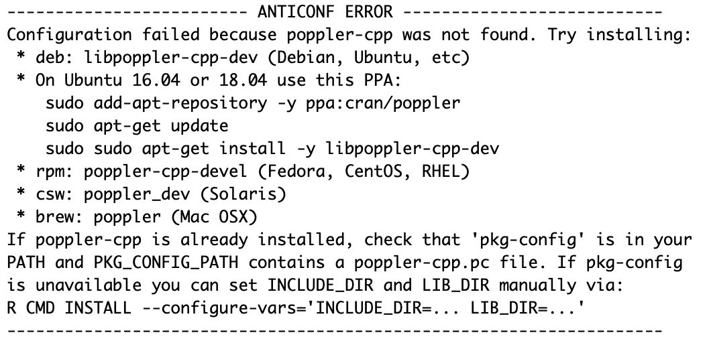
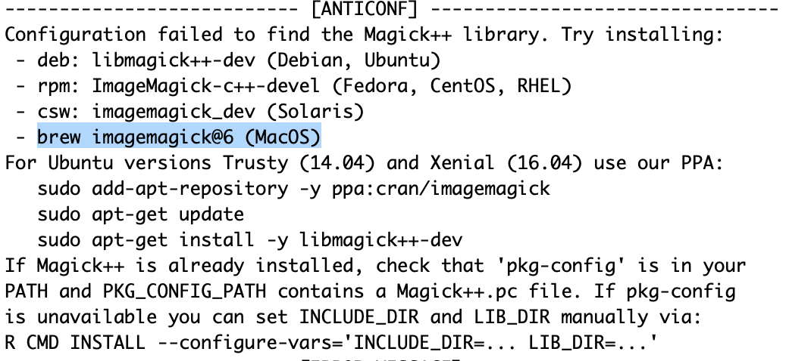
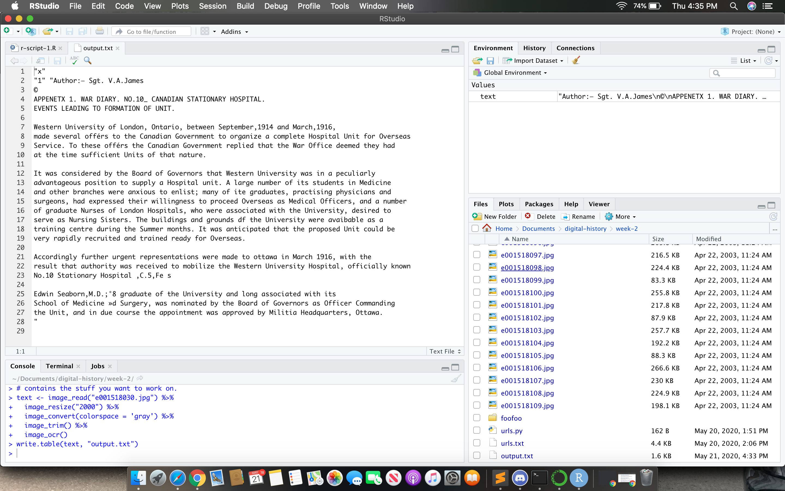

This week definitely gave me more trouble than previously. I felt pretty overshelmed by Wget and couldn't see the point of it yet, so it made it slow going to get me motivated to work on it. Discord's "search" function was invaluable in helping me get through certain spots. 

### Anaconda 

I have downloaded this software before for another class (though I was on a different laptop at the time),
so I was (somewhat) familiar with it.

It did take me a shamefully long time to figure out how to access the command line, but I eventually got it. 

### Wget

This section presented a challenge for me, and I wasn't ultimately able to get the program for fetching urls working, although I was able to fetch and store individual urls, which I could definitely see as coming in handy in the future. 

#### Homebrew

- the ask for a passwrod to install homebrew briefly had me stumped, until I realized it was the password for my laptop itself (not somethign specific to python).
- I got this message after my first attempt at installing: 
``` 
Error downloading Command Line Tools for Xcode: The operation couldn’t be completed. (PKDownloadError error 8.) 
Done.
Error downloading updates.
==> /usr/bin/sudo /bin/rm -f /tmp/.com.apple.dt.CommandLineTools.installondemand.in-progress
==> /usr/bin/sudo /usr/bin/xcode-select --switch /Library/Developer/CommandLineTools
xcode-select: error: invalid developer directory '/Library/Developer/CommandLineTools'
Failed during: /usr/bin/sudo /usr/bin/xcode-select --switch /Library/Developer/CommandLineTools
``` 

I went to [this](https://treehouse.github.io/installation-guides/mac/homebrew) website, which told me to 
download "Xcode" from the apple app store. I did, and then the homebrew installation worked. 

#### Sublime Text

I hadn't intalled this yet so I felt quite lost, since there was nothing on the website specifically telling us how to set it up. I tried to follow [this](https://docs.anaconda.com/anaconda/user-guide/tasks/integration/sublime/) tutorial but then got stuck at the point when you're supposed to search "conda" in the command palette-- "conda" was not showing up when I searched it. I fell into a bit of a rabbit hole trying to figure out how to use anaconda, then python, and eventually I moved on to the next section as I was already a few days behind and wanted to get through this week's material. 

UPDATE: So I asked on discord about where my problem might be, since sublime seems unavoidable, and they really helped me figure out what I was doing (shoutout to cochantal)! I realize now that sublime doesn't need to be linked up to any other application, it's just a basic sort of tool, and all you do to make it a python file is save it as .py and invoke it with "python" in the command line. My real problem was not understanding how to navigate the directories properly, and being generally unfamiliar with coding language. 

### APIs -- Json

Once I had a better grasp of how to use the terminal and sublime text, this task was much easier. I was able to make the file and save it as a table and open it in "numbers," as well as save it as a permalink [here](https://json-csv.com/c/Yte9). 

### OCRs -- R Script 

I tried launching it several times and nothing happened. I looked more closely at the image on the instructions page and saw it was using a different version (1.456) form the one it automatically chose when I installed anaconda. After downloading the correct version, I attempted to run the code provided, I got a long error including this messgae for tesseract: 



And this for magick:

 

I asked for help in Discord and eventually just dowloaded R-studio independent of anaconda. (I will probably have to delete the other version as my computer's storage has been filling up.) Once I re-opened the r-script I had already started, there was a small yellow banner saying `packages, magick, magrittr, and tesseract required but are not installed. Install Don't Show Again`. I was tempted to click but slightly afraid I would screw something up, so just clicked "run" again. 

The code ran, and I was able to OCR the file!


